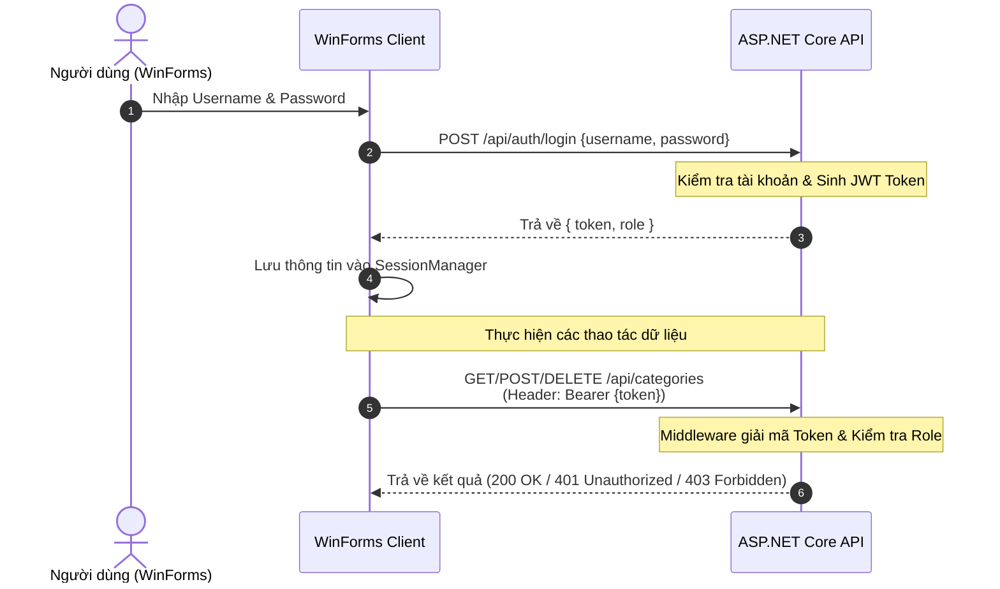

<div align="center">

# 🛒 MINISUPERMARKET SYSTEM
### Hệ Thống Quản Lý Siêu Thị Mini (Client - Server)


**Môn học:** Lập trình Ứng dụng .NET Core *(Mã môn: 229162)*  
**Bài thực hành:** Buổi 2 — Bảo mật Web API bằng JWT, Phân quyền RBAC & Màn hình Đăng nhập WinForms

---

</div>

## 📑 Mục lục
- [📖 Giới thiệu](#-1-giới-thiệu)
- [✨ Tính năng hệ thống](#-2-tính-năng-hệ-thống)
- [🏗️ Kiến trúc & Luồng xác thực](#-3-kiến-trúc--luồng-xác-thực)
- [🛠️ Công nghệ sử dụng](#-4-công-nghệ-sử-dụng)
- [📂 Cấu trúc Solution](#-5-cấu-trúc-solution)
- [👥 Tài khoản & Phân quyền](#-6-tài-khoản--phân-quyền)
- [🚀 Hướng dẫn cài đặt & Chạy](#-7-hướng-dẫn-cài-đặt--chạy)
- [🧪 Kịch bản kiểm thử](#-8-kịch-bản-kiểm-thử)
- [🛠️ Xử lý lỗi thường gặp](#-9-xử-lý-lỗi-thường-gặp)
- [🔭 Lộ trình phát triển](#-10-lộ-trình-phát-triển)
- [👨‍💻 Thông tin tác giả](#-11-thông-tin-tác-giả)

---

## 📖 1. Giới thiệu

**MiniSupermarket** là dự án hệ thống quản lý siêu thị mini theo kiến trúc Client - Server hiện đại. Dự án được phát triển song song giữa RESTful Web API (Backend) và Desktop Client (WinForms POS).

| Buổi | Nội dung chính | Trạng thái |
| :---: | :--- | :---: |
| **1** | Web API quản lý danh mục (CRUD) + WinForms Client căn bản |  |
| **2** | Bảo mật JWT, Phân quyền RBAC (Admin/Cashier), Màn hình Auth WinForms |  |
| **3** | Kết nối CSDL SQL Server thông qua Entity Framework Core (Code First) |  |

---

## ✨ 2. Tính năng hệ thống

<details open>
<summary><b>🔥 Backend — ASP.NET Core Web API</b></summary>

* **Xác thực & Ủy quyền:** Đăng nhập cấp phát JWT Access Token (Thời hạn 2 giờ).
* **Bảo vệ Endpoint:** Áp dụng bộ lọc `[Authorize]` trên các REST API quản lý danh mục.
* **Phân quyền theo vai trò (RBAC):** Phân chia quyền hạn `Admin` và `Cashier` qua `[Authorize(Roles = "...")]`.
* **Quản lý danh mục:** Hỗ trợ đầy đủ các thao tác CRUD danh mục sản phẩm.
* **Tích hợp Swagger UI:** Tích hợp bộ cấu hình Bearer Token trực tiếp trên giao diện Swagger để test API.
</details>

<details open>
<summary><b>💻 Frontend — Windows Forms Client</b></summary>

* **Giao diện Đăng nhập:** Thiết kế tối ưu UX (ẩn ký tự mật khẩu, bắt sự kiện phím `Enter`).
* **Quản lý phiên (SessionManager):** Lưu giữ Token và thông tin Roles trong bộ nhớ tạm của App.
* **Giao diện Quản lý Danh mục:** Hiển thị dữ liệu tương tác qua `DataGridView`, nhận diện vai trò người dùng hiện tại.
* **Xử lý ngoại lệ HTTP:** Hiển thị thông báo người dùng thân thiện khi gặp lỗi cấp quyền (`401 Unauthorized`, `403 Forbidden`).
</details>

---

## 🏗️ 3. Kiến trúc & Luồng xác thực

Dự án tuân thủ mô hình tách biệt hoàn toàn giữa **Backend** và **Frontend**:

```
[ WinForms POS Client ] <--- (HTTP / JSON + Bearer Token) ---> [ ASP.NET Core Web API ]
```

### 🔐 Luồng xác thực (Authentication Flow)



### 🧾 Cấu trúc JWT Token

Token được cấu tạo bởi 3 phần chuẩn hóa (`Header.Payload.Signature`):

| Thành phần | Thuật toán / Giá trị | Mô tả |
| :--- | :--- | :--- |
| **Header** | `HS256` | Khai báo thuật toán mã hóa chữ ký |
| **Payload** | `Claims` | Chứa `name` (username), `role` (vai trò), `exp` (thời gian hết hạn) |
| **Signature** | `JwtSettings:Secret` | Chữ ký điện tử đảm bảo dữ liệu không bị can thiệp |

> 💡 *Bạn có thể sao chép chuỗi Token và dán vào trang [jwt.io](https://jwt.io/) để kiểm tra nội dung Payload.*

---

## 🛠️ 4. Công nghệ sử dụng

| Lớp kiến trúc | Công nghệ & Thư viện |
| :--- | :--- |
| **Core Framework** | C# (.NET 8.0) |
| **Backend API** | ASP.NET Core Web API, Controller-based Architecture, In-Memory Data |
| **Security & Auth** | `Microsoft.AspNetCore.Authentication.JwtBearer`<br/>`System.IdentityModel.Tokens.Jwt` |
| **Frontend UI** | Windows Forms (.NET 8.0 Desktop Dev), `System.Net.Http.Json` |
| **API Documentation** | Swagger UI (`Swashbuckle.AspNetCore`) |
| **IDE** | Visual Studio 2022 (v17.8+) |

---

## 📂 5. Cấu trúc Solution

```text
MiniSupermarket/
├── 📄 MiniSupermarket.sln
├── 📄 README.md
│
├── 📦 MiniSupermarket.API/                   # Backend Web API
│   ├── 📁 Controllers/
│   │   ├── 📄 AuthController.cs              # API Đăng nhập & sinh JWT Token 🆕
│   │   └── 📄 CategoriesController.cs        # CRUD Danh mục + Phân quyền RBAC ✏️
│   ├── 📁 Properties/
│   │   └── 📄 launchSettings.json            # Base Url: https://localhost:7123
│   ├── 📄 appsettings.json                   # Cấu hình Secret Key & JwtSettings
│   └── 📄 Program.cs                         # Config JWT Bearer & Swagger Doc ✏️
│
└── 📦 MiniSupermarket.WinForms/              # Frontend Client
    ├── 📄 FormLogin.cs                       # Form Đăng nhập hệ thống 🆕
    ├── 📄 FormCategoryManagement.cs          # Form Quản lý Danh mục ✏️
    ├── 📄 SessionManager.cs                  # Lớp lưu trữ Token & Role toàn cục 🆕
    ├── 📄 CategoryDto.cs                     # Model Data Transfer Object
    └── 📄 Program.cs                         # Điểm điều hướng khởi chạy ứng dụng ✏️
```

---

## 👥 6. Tài khoản & Phân quyền

### 🔑 Tài khoản thử nghiệm

| Username | Password | Vai trò | Chi tiết quyền hạn |
| :--- | :---: | :---: | :--- |
| `admin` | `123456` | **Admin** | **Full Access:** Xem, thêm, sửa, xóa danh mục và truy cập Dashboard |
| `cashier` | `123456` | **Cashier** | **Limited:** Xem, thêm, sửa danh mục, dùng POS *(Không có quyền Xóa)* |

### 🌐 Chi tiết API Endpoints

| HTTP Method | Endpoint | Yêu cầu Authentication | Quyền tối thiểu (Role) |
| :---: | :--- | :---: | :---: |
| `POST` | `/api/auth/login` | 🌐 Public | Tất cả |
| `GET` | `/api/categories` | 🔐 Authorized | Authenticated User |
| `GET` | `/api/categories/{id}` | 🔐 Authorized | Authenticated User |
| `POST` | `/api/categories` | 🔐 Authorized | Authenticated User |
| `PUT` | `/api/categories/{id}` | 🔐 Authorized | Authenticated User |
| `DELETE` | `/api/categories/{id}` | 🔐 Authorized | 🛡️ **Admin** |
| `GET` | `/api/categories/admin-dashboard` | 🔐 Authorized | 🛡️ **Admin** |
| `GET` | `/api/categories/staff-pos` | 🔐 Authorized | 👮 **Admin, Cashier** |

### 🚦 Mã phản hồi HTTP (HTTP Status Codes)

* `200 OK`: Thao tác thành công.
* `401 Unauthorized`: Yêu cầu xác thực (Chưa gửi Token, Token không hợp lệ hoặc đã hết hạn).
* `403 Forbidden`: Bị từ chối truy cập (Đã xác thực nhưng tài khoản không đủ quyền hạn/Role).

---

## 🚀 7. Hướng dẫn cài đặt & Chạy

### 📋 Yêu cầu môi trường
* **Visual Studio 2022** (Đã cài Workload *ASP.NET and web development* & *.NET desktop development*).
* **.NET 8.0 SDK**

### 🔌 Các bước thực hiện

1. **Clone Repository:**
   ```bash
   git clone https://github.com/your-username/MiniSupermarket.git
   cd MiniSupermarket
   ```

2. **Chạy Backend Web API:**
   * Mở solution `MiniSupermarket.sln` trên Visual Studio.
   * Chuột phải vào project **`MiniSupermarket.API`** $\rightarrow$ Chọn **Set as Startup Project**.
   * Nhấn `F5` để khởi chạy. Trình duyệt sẽ mở giao diện Swagger UI tại đường dẫn:  
     `https://localhost:7123/swagger`

3. **Chạy Frontend WinForms Client:**
   * Kiểm tra thuộc tính `SessionManager.ApiBaseUrl` khớp với cổng API (`https://localhost:7123/api/`).
   * Chuột phải vào project **`MiniSupermarket.WinForms`** $\rightarrow$ Chọn **Debug** $\rightarrow$ **Start New Instance**.
   * Tiến hành đăng nhập bằng tài khoản mẫu.

> 💡 **Tip thiết lập Multiple Startup Projects:**  
> Chuột phải vào **Solution** $\rightarrow$ Chọn **Properties** $\rightarrow$ **Startup Project** $\rightarrow$ Chọn **Multiple startup projects** $\rightarrow$ Chọn Action của cả `MiniSupermarket.API` và `MiniSupermarket.WinForms` thành **Start** (Đảm bảo API xếp trên WinForms).

---

## 🧪 8. Kịch bản kiểm thử

<details>
<summary><b>🌐 8.1. Kiểm thử trên Swagger UI</b></summary>

1. Gọi `GET /api/categories` khi chưa Authenticate $\rightarrow$ Kết quả trả về `401 Unauthorized`.
2. Gọi `POST /api/auth/login` với body: `{"username": "cashier", "password": "123456"}` $\rightarrow$ Trả về `200 OK` kèm chuỗi Token.
3. Chọn nút **Authorize** (góc trên bên phải), nhập `Bearer <chuỗi_token_vừa_copy>` $\rightarrow$ Nhấn **Authorize**.
4. Thực hiện lại request `GET /api/categories/staff-pos` $\rightarrow$ Trả về `200 OK`.
5. Thực hiện request `DELETE /api/categories/1` bằng tài khoản cashier $\rightarrow$ Trả về `403 Forbidden`.
</details>

<details>
<summary><b>💻 8.2. Kiểm thử trên WinForms Client</b></summary>

1. Nhập sai thông tin mật khẩu $\rightarrow$ Đăng nhập thất bại, hiển thị thông báo lỗi.
2. Đăng nhập với tài khoản `cashier` $\rightarrow$ Mở `FormCategoryManagement`, hiển thị thông tin role: **Cashier**.
3. Thực hiện thao tác Thêm danh mục $\rightarrow$ Dữ liệu cập nhật thành công trên Grid.
4. Chọn 1 dòng dữ liệu và nhấn nút **Xóa** $\rightarrow$ Hiển thị MessageBox thông báo lỗi `403 (Chỉ Admin mới có quyền xóa)`.
5. Đăng xuất và đăng nhập lại bằng `admin` $\rightarrow$ Thao tác Xóa thành công.
</details>

---

## 🛠️ 9. Xử lý lỗi thường gặp

| Hiện tượng lỗi | Nguyên nhân | Giải pháp |
| :--- | :--- | :--- |
| **Lỗi kết nối Server** | Web API chưa chạy hoặc sai port | Kiểm tra và chạy Web API trước; Kiểm tra biến `ApiBaseUrl` |
| **Lỗi SSL Certificate** | Máy chưa trust SSL Dev Cert | Chạy lệnh Terminal: `dotnet dev-certs https --trust` |
| **Luôn nhận lỗi 401** | Nhập thiếu tiền tố `Bearer` hoặc sai thứ tự Middleware | Thêm từ khóa `Bearer <token>` khi truyền Header; Kiểm tra `UseAuthentication()` phải đứng trước `UseAuthorization()` trong `Program.cs` |
| **Swagger thiếu nút Authorize** | Chưa thêm `AddSecurityDefinition` | Cập nhật cấu hình SwaggerGen trong file `Program.cs` |
| **Lỗi JWT Key quá ngắn** | Secret Key $< 256$ bits ($< 32$ ký tự) | Cập nhật chuỗi Secret dài hơn 32 ký tự trong `appsettings.json` |

---

## 🔭 10. Lộ trình phát triển

- [x] Tích hợp JWT Authentication & Role-based Authorization (RBAC).
- [ ] Chuyển đổi dữ liệu từ In-Memory sang **SQL Server** thông qua **Entity Framework Core** *(Dự kiến Buổi 3)*.
- [ ] Mã hóa và băm mật khẩu người dùng trong CSDL bằng thuật toán **BCrypt**.
- [ ] Cải tiến UI WinForms: Phân quyền động trên giao diện (Tự động ẩn nút Xóa nếu không phải Admin).
- [ ] Quản lý phiên làm việc nâng cao: Tích hợp **Refresh Token** và Cơ chế Đăng xuất.
- [ ] Phát triển các module mở rộng: Sản phẩm (Products), Hóa đơn (Invoices), Khách hàng (Customers).

> ⚠️ **Lưu ý bảo mật:** Việc cấu hình tài khoản cứng (Hardcoded) và lưu Jwt Secret Key trong file `appsettings.json` chỉ áp dụng cho mục đích học tập. Khi triển khai thực tế (Production), cần lưu trữ thông tin nhạy cảm trong Environment Variables hoặc Azure Key Vault.

---

## 👨‍💻 11. Thông tin tác giả

<div align="center">

| 👤 Họ và Tên | 🆔 Mã Sinh Viên | 🏫 Lớp Học Phần |
| :--- | :---: | :---: |
| **Hồ Mai Phúc Thịnh** | `2124110119` | **CCQ2411D** |

---
*Báo cáo bài thực hành Môn Lập trình Ứng dụng .NET Core*
</div>